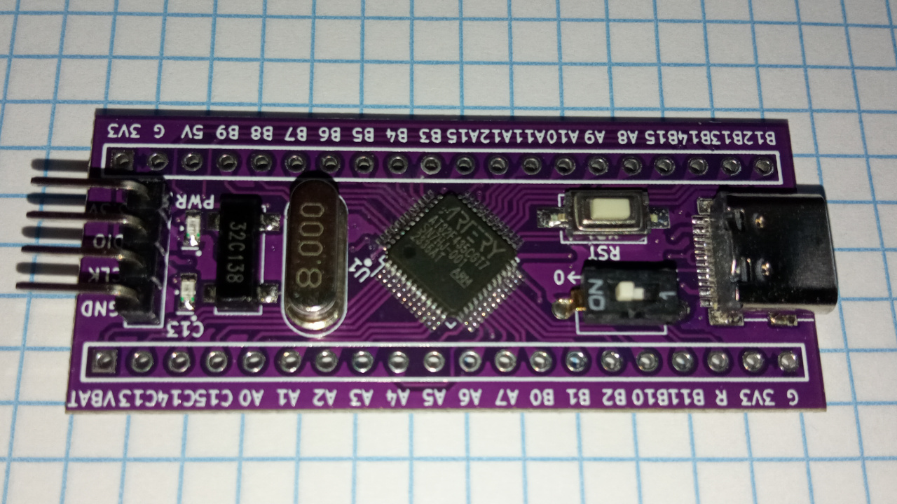

# at32f435-start

[](doc/at32f435_big.jpg)

This is firmware for a debug probe that solves the question what to choose - [OpenOCD](https://openocd.org/) or [Black Magic Probe](https://black-magic.org/index.html). With this firmware you do not have to choose between OpenOCD and Black Magic Probe - it does both.

## use

Use openocd or black magic probe.

### openocd

For openocd, use cmsis-dap:

```bash
$ ./bin/openocd -f openocd/scripts/interface/cmsis-dap.cfg -f openocd/scripts/target/stm32f0x.cfg
...
Info : Listening on port 3333 for gdb connections
```

In another window:

```bash
~$ arm-none-eabi-gdb -q
(gdb) tar ext :3333
Remote debugging using :3333
```

### black magic

For black magic probe, connect to the first of the two usb serials:

```bash
$ arm-none-eabi-gdb -q
(gdb) tar ext /dev/ttyACM0
Remote debugging using /dev/ttyACM0
```

Connect the second usb serial to the target console:

```bash
$ minicom -D /dev/ttyACM1
```

## specs

- [at32f435](https://www.arterychip.com/en/product/AT32F435.jsp) arm processor, 288MHz, 1024 kbyte flash, 512 kbyte ram.
- [rt-thread](https://www.rt-thread.io/) open source real-time operating system
- [CherryUSB](https://github.com/cherry-embedded/CherryUSB) open source usb stack
- [Black Magic](https://github.com/blackmagic-debug/blackmagic) open source debug probe with built-in gdb server
- [free-dap](https://github.com/ataradov/free-dap) a free and open source implementation of the CMSIS-DAP debugger firmware.

## pinout

| SIGNAL | PIN |
| ------ | --- |
| SWCLK  | A4  |
| SWDIO  | A5  |
| TDI    | A6  |
| TDO    | A7  |
| TXD    | B10 |
| RXD    | B11 |

_not truncated_
